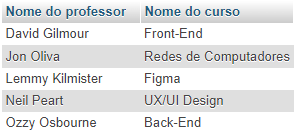

# Comandos da etapa 3 do exercício de banco de dados

## CRUD - Consultas

### 1) Faça uma consulta que mostre os alunos que nasceram antes do ano 2009

```sql
SELECT nome AS "Nome", data_nascimento AS "Data de Nascimento" FROM alunos
	WHERE data_nascimento < "2009-01-01"
	ORDER BY data_nascimento;
```


### 2) Faça uma consulta que calcule a média das notas de cada aluno e as mostre com duas casas decimais.

```sql
SELECT
    nome AS Nome,
    CAST(((nota_1 + nota_2) / 2) AS DEC(6, 2)) AS Média
FROM alunos;
```


### 3) Faça uma consulta que calcule o limite de faltas de cada curso de acordo com a carga horária. Considere o limite como 25% de carga horária. Classifique em ordem crescente pelo título do curso.

```sql
SELECT 
	titulo AS "Curso",
    carga_horaria AS "Carga horária",
    (carga_horaria * 0.25) AS "Limite de Faltas"
FROM cursos;
```


### 4) Faça uma consulta que mostre os nomes dos professores que são somente da área "desenvolvimento".

```sql
SELECT
	nome AS "Professor",
    area_atuacao AS "Area de atuação"
FROM professores
WHERE area_atuacao = 2;
```


### 5) Faça uma consulta que mostre a quantidade de professores que cada área ("design", "infra", "desenvolvimento") possui.

```sql
SELECT
	area_atuacao AS "Área de atuação",
    COUNT(id) AS "Qtd de professores"
FROM professores
GROUP BY area_atuacao;
```


### 6) Faça uma consulta que mostre o nome dos alunos, o título e a carga horária dos cursos que fazem.

```sql
SELECT
	alunos.nome AS "Nome do aluno",
    cursos.titulo AS "Nome do curso",
    cursos.carga_horaria AS "Carga horária do curso"
FROM alunos INNER JOIN cursos
ON alunos.cursos_id = cursos.id;
```


### 7) Faça uma consulta que mostre o nome dos professores e o título do curso que lecionam. Classifique pelo nome do professor.

```sql
SELECT
	professores.nome AS "Nome do professor",
    cursos.titulo AS "Nome do curso"
FROM professores INNER JOIN cursos
ON professores.cursos_id = cursos.id
ORDER BY professores.nome;
```



### 8) Faça uma consulta que mostre o nome dos alunos, o título dos cursos que fazem, e o professor de cada curso.

```sql
SELECT
	alunos.nome AS "Nome do aluno",
    cursos.titulo AS "Nome do curso",
    professores.nome AS "Nome do professor"
FROM cursos
	INNER JOIN alunos ON cursos.id = alunos.cursos_id
    INNER JOIN professores ON cursos.id = professores.cursos_id;
```


### 9) Faça uma consulta que mostre a quantidade de alunos que cada curso possui. Classifique os resultados em ordem descrecente de acordo com a quantidade de alunos.

```sql
SELECT
	cursos.titulo AS "Nome do curso",
    COUNT(alunos.id) AS "Qtd de alunos"
FROM cursos INNER JOIN alunos
ON cursos.id = alunos.cursos_id
GROUP BY cursos.titulo
ORDER BY COUNT(alunos.id) DESC;
```


### 10) Faça uma consulta que mostre o nome dos alunos, suas notas, médias, e o título dos cursos que fazem. Devem ser considerados somente os alunos de Front-End e Back-End. Mostre os resultados classificados pelo nome do aluno.

```sql
SELECT
	alunos.nome AS "Nome do aluno",
    alunos.nota_1 AS "Primeira nota",
    alunos.nota_2 AS "Segunda nota",
    CAST(((alunos.nota_1 + alunos.nota_2) / 2) AS DEC(6, 2)) AS "Média",
    cursos.titulo AS "Nome do curso"
FROM alunos INNER JOIN cursos
ON alunos.cursos_id = cursos.id
WHERE cursos.id = 1 OR cursos.id = 2
ORDER BY alunos.nome;
```


### 11) Faça uma consulta que altere o nome do curso de Figma para Adobe XD e sua carga horária de 10 para 15.

```sql
UPDATE cursos SET
	titulo = "Adobe XD",
    carga_horaria = 15
WHERE id = 4;
```


### 12) Faça uma consulta que exclua um aluno do curso de Redes de Computadores e um aluno do curso de UX/UI.

```sql
DELETE FROM alunos WHERE cursos_id = 5 LIMIT 1;
DELETE FROM alunos WHERE cursos_id = 3 LIMIT 1;
```


### 13) Faça uma consulta que mostre a lista de alunos atualizada e o título dos cursos que fazem, classificados pelo nome do aluno.

```sql
SELECT
	alunos.nome AS "Nome do aluno",
    cursos.titulo AS "Nome do curso"
FROM alunos INNER JOIN cursos
ON alunos.cursos_id = cursos.id
ORDER BY alunos.nome;
```


## DESAFIOS

### 1) Criar uma consulta que calcule a idade do aluno.

```sql
SELECT
	nome AS "Nome do aluno",
    data_nascimento AS "Data de nascimento",
    CAST((DATEDIFF(CURDATE(), data_nascimento) / 365) AS INT) AS "Idade"
FROM alunos;
```


